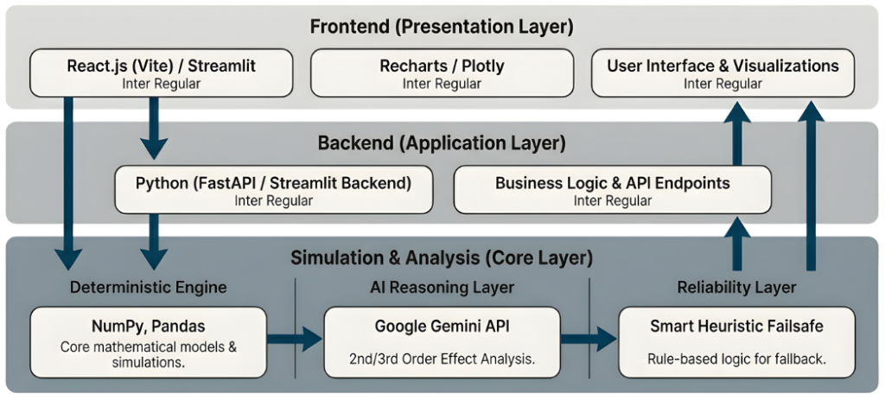

<p align="center">
  
  
  
  
</p>

<h1 align="center">🎯 SecondOrder</h1>

<p align="center">
  <strong>AI-Powered Strategic Business Simulation Engine</strong><br>
  <em>See beyond the obvious. Model the ripple effects of every decision.</em>
</p>

<p align="center">
  <a href="#-the-problem">Problem</a> •
  <a href="#-the-solution">Solution</a> •
  <a href="#-how-it-works">How It Works</a> •
  <a href="#-quick-start">Quick Start</a> •
  <a href="#-features">Features</a> •
  <a href="#-tech-stack">Tech Stack</a>
</p>

---

## ❌ The Problem

Traditional financial models are **dangerously naive**. They assume:
- Linear cause and effect
- Static market conditions
- No competitor responses
- No systemic feedback loops

**Reality check:** When you cut costs, you don't just "save money." Your best engineers leave. Product quality drops. Customers churn. Competitors sense weakness and capture market share.

> *"In complex systems, first-order thinking is how you lose."*

---

## ✅ The Solution

**SecondOrder** is a next-generation business simulation engine that models the **true physics of business decision-making** through three lenses:

| Order | What It Models | Example |
|-------|---------------|---------|
| **1st Order** | Direct, immediate effects | "Cut costs" → Burn decreases |
| **2nd Order** | Systemic feedback loops | "Cut costs" → Product quality drops → Churn increases |
| **3rd Order** | Strategic emergent effects | "Cut costs" → Competitors sense weakness → Market share erodes |

Powered by **Google Gemini 2.0**, SecondOrder runs **Monte Carlo simulations across 50+ parallel futures** to give you probability-weighted outcomes—not just one guess.

---

## 🧠 How It Works

<p align="center">
  
</p>

```
┌─────────────────────────────────────────────────────────────────┐
│                        YOUR DECISION                            │
│                  "Increase ad spend by 30%"                     │
└───────────────────────────┬─────────────────────────────────────┘
                            ▼
┌─────────────────────────────────────────────────────────────────┐
│  1️⃣ FIRST ORDER ENGINE                                          │
│  • Direct financial impact: -$30K/month                         │
│  • Traffic increase: +40% leads                                 │
└───────────────────────────┬─────────────────────────────────────┘
                            ▼
┌─────────────────────────────────────────────────────────────────┐
│  2️⃣ SECOND ORDER ENGINE                                         │
│  • CAC rises as ad market saturates                             │
│  • Sales team bandwidth stretched → conversion drops            │
│  • Cash runway shortened → fundraising pressure                 │
└───────────────────────────┬─────────────────────────────────────┘
                            ▼
┌─────────────────────────────────────────────────────────────────┐
│  3️⃣ THIRD ORDER ENGINE (Gemini AI)                              │
│  • Competitors respond with price cuts                          │
│  • Market perceives desperation → brand damage                  │
│  • Talent market tightens as cash signal weakens               │
└───────────────────────────┬─────────────────────────────────────┘
                            ▼
┌─────────────────────────────────────────────────────────────────┐
│  🎲 MONTE CARLO SIMULATION                                       │
│  50 parallel futures × 12 months = Probability Cloud            │
│  ─────────────────────────────────────────────────              │
│  P10 (Downside):  $120K remaining                               │
│  P50 (Median):    $340K remaining                               │
│  P90 (Upside):    $580K remaining                               │
│  Survival Rate:   73%                                           │
└─────────────────────────────────────────────────────────────────┘
```

---

## 🚀 Quick Start

### Prerequisites
- Python 3.10+
- Node.js 18+
- Google Gemini API Key ([Get one free](https://makersuite.google.com/app/apikey))

### 1. Clone & Configure
```bash
git clone https://github.com/vibhorrrrr/SecondOrder.git
cd SecondOrder

# Set your API key
echo "GOOGLE_API_KEY=your-api-key-here" > .env
```

### 2. Launch
```bash
./start.sh
```

### 3. Open
- 🖥️ **Frontend**: http://localhost:5173
- ⚙️ **API Docs**: http://localhost:8000/docs

### Manual Setup (Alternative)
```bash
# Backend
pip install -r requirements.txt
python api.py

# Frontend (new terminal)
cd ui && npm install && npm run dev
```

---

## ✨ Features

### 🎲 Monte Carlo Simulation Engine
- **50+ parallel simulation paths** per scenario
- **P10/P50/P90 probability distributions** for every outcome
- **Survival probability scoring** to quantify risk

### 🌳 MCTS Decision Trees
- **Monte Carlo Tree Search** to explore optimal strategy paths
- **UCB1 exploration-exploitation** balancing
- **Kelly Criterion bet sizing** for capital allocation

### 🤖 Gemini AI Integration
- **3rd-order effect generation** in real-time
- **Strategic recommendations** based on simulation results
- **Risk/opportunity identification** with context-aware analysis

### 📊 Interactive Dashboard
- **Real-time simulation visualization**
- **Decision tree explorer** with drill-down analysis
- **Trace viewer** to inspect individual simulation paths

### 🛡️ Enterprise-Grade Reliability
- **Heuristic fallback engine** when AI is unavailable
- **Deterministic mode** for reproducible results
- **Comprehensive logging** and error handling

---

## 🛠 Tech Stack

| Layer | Technology |
|-------|------------|
| **AI Engine** | Google Gemini 2.0 Flash/Pro |
| **Backend** | Python, FastAPI, NumPy, Pydantic |
| **Simulation** | Monte Carlo, MCTS, Kelly Criterion |
| **Frontend** | React 18, Vite, Recharts, TailwindCSS |
| **API** | REST with OpenAPI/Swagger docs |

---

## 📁 Project Structure

```
SecondOrder/
├── api.py                    # FastAPI server entry point
├── monte_carlo.py            # Monte Carlo simulation engine
├── mcts.py                   # Monte Carlo Tree Search
├── simulation_engine.py      # Core business physics engine
├── bet_sizing.py             # Kelly Criterion capital allocation
├── business_state.py         # State vector definition
├── first_order.py            # Direct effects calculator
├── second_order.py           # Feedback loop modeler
├── node_generation_gemini.py # AI decision node generator
├── third_order_gemini.py     # AI emergent effects engine
├── validators.py             # Input validation layer
├── causal_graph_prototype.py # Cause-effect graph modeling
│
├── ui/                       # React frontend
│   ├── src/
│   │   ├── components/
│   │   │   ├── SimulationDashboard.jsx
│   │   │   ├── SimulationChart.jsx
│   │   │   ├── TreeView.jsx
│   │   │   ├── NodeDetails.jsx
│   │   │   ├── StreamingPanel.jsx
│   │   │   └── TraceViewerModal.jsx
│   │   └── services/         # API client layer
│   └── ...
│
├── start.sh                  # One-command launcher
├── stop.sh                   # Graceful shutdown
└── requirements.txt          # Python dependencies
```

---

## 🔌 API Reference

### `POST /simulate`
Run a Monte Carlo simulation with action modifiers.

```json
{
  "initial_state": {
    "cash": 500000,
    "monthly_revenue": 50000,
    "monthly_burn": 80000,
    "customers": 100
  },
  "action": {
    "monthly_burn": 100000
  },
  "months": 12,
  "num_runs": 50
}
```

### `POST /generate_nodes`
Generate AI-powered decision options for a given state.

```json
{
  "state": {
    "cash": 500000,
    "monthly_revenue": 50000,
    "monthly_burn": 80000
  }
}
```

---

## 📈 Sample Output

```json
{
  "survival_probability": 0.73,
  "p10": 120000,
  "p50": 340000,
  "p90": 580000,
  "gemini_recommendations": [
    "Consider extending runway via bridge round before aggressive growth",
    "Optimize CAC before scaling ad spend"
  ],
  "gemini_risks": [
    "Cash runway below 6 months triggers talent flight risk",
    "Competitor response likely within 60 days"
  ]
}
```

---

## 🤝 Contributing

We welcome contributions! Please see our [Contributing Guide](CONTRIBUTING.md) for details.

---

## 📄 License

MIT License - see [LICENSE](LICENSE) for details.

---

<p align="center">
  <strong>Built for founders who think in systems, not spreadsheets.</strong><br>
  <em>Made with ❤️ and a lot of Monte Carlo simulations</em>
</p>
