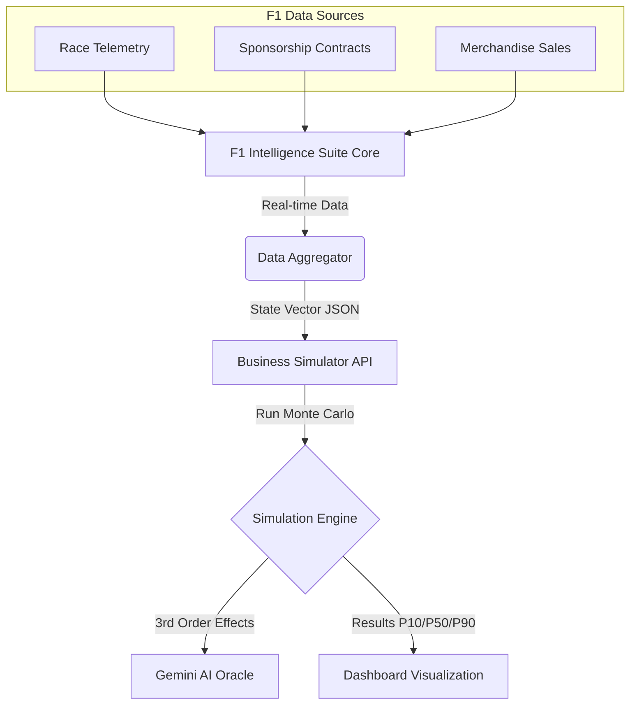

# F1 Intelligence Suite & Business Simulator Integration

## 1. Executive Summary
The **F1 Intelligence Suite** acts as the central command for managing an F1 Team's operations (Race Strategy, Logistics, Marketing). The **Business Simulator** acts as the *Financial & Strategic Forecasting Engine* for this suite.

The integration allows F1 Team Principals to answer questions like:
*   *"If we sign Max Verstappen (High Cost) but win the Championship (High Revenue), do we survive the cash burn?"*
*   *"If we pivot to a fan-token based revenue model, what is our 12-month runway?"*

## 2. Integration Architecture Diagram



## 3. Data Interface (The Bridge)

The integration relies on mapping **F1 Operational Metrics** to **SaaS Business Metrics**.

### 3.1 Input Mapping
The F1 Suite sends a JSON payload to the Simulator's `/simulate` endpoint.

| F1 Metric | Business Simulator Input | Logic |
| :--- | :--- | :--- |
| **Prize Money + Sponsorships** | `revenue` | Recurring & One-off inputs. |
| **Team Budget Cap + Salaries** | `burn` | Monthly operational costs. |
| **Fanbase Size** | `traffic` | The top-of-funnel audience. |
| **Merch Conversion Rate** | `conversion` | How effectively fans monetize. |
| **Driver Marketing Appeal** | `ad_spend` (proxy) | Organic reach vs Paid reach. |
| **Contract Durations** | `runway` | Time until next major cash event. |

### 3.2 Output Consumption
The Simulator returns a **Risk Profile** which the F1 Suite consumes to display red/green flags on the Team Dashboard.

*   **P10 Cash (The Crash)**: Alerts the Principal if there is >10% chance of insolvency mid-season.
*   **Gemini Recommendations**: The "Strategy Cards" (e.g., "Slash Operational Burn") become "Team Orders" (e.g., "Reduce Wind Tunnel hours").

## 4. Technical Implementation

### A. API Contract
The F1 Suite makes a POST request:

```json
POST /simulate
{
  "initial_state": {
    "cash": 145000000,       // Cost Cap Budget
    "burn": 12000000,        // Monthly Team Burn
    "revenue": 8000000,      // Monthly Sponsorship Income
    "traffic": 50000000,     // Global TV Reach
    "ad_spend": 2000000,     // Marketing Budget
    ...
  },
  "action": {
    "name": "Sign Top Driver",
    "cost": 50000000
  }
}
```

### B. The Heuristic Handshake
If the primary AI service is offline during a race weekend (mission critical), the **Smart Failsafe** ensures the F1 Suite still gets a valid strategy:
*   *Input:* Low Cash, High Burn.
*   *Failsafe Logic:* Recommends "Pay Driver" signing or "Chassis Dev Freeze".

## 5. Future Roadmap: Digital Twin
The next phase of integration uses **Digital Twins**:
1.  **Race Sim**: Simulates track performance (Lap times).
2.  **Biz Sim**: Simulates financial performance (Bank balance).

These will run in parallel loops: *Better lap times -> Higher Merch Sales -> Higher Budget -> Better Car.*
